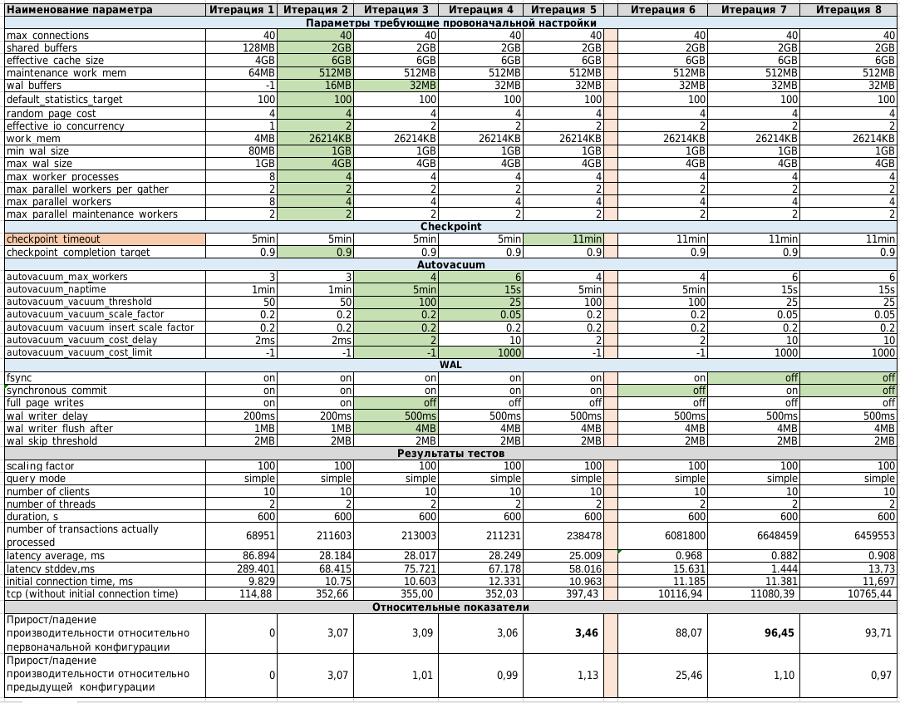

### Нагрузочное тестирование и тюнинг PostgreSQL

Цель:

Cделать нагрузочное тестирование PostgreSQL

Настроить параметры PostgreSQL для достижения максимальной производительности

### Выполнение ДЗ

#### Развернуть виртуальную машину,поставить на неё PostgreSQL 14
Параметры ВМ:

    ОС - Ubuntu 20.04
    CPU - 4 ядра
    RAM - 8GB
    Disk - НDD, 20 GB, Шина (драйвер) - VirtIO

Витруальная машина развернута на гипервизоре KVM.

#### Настроика кластер PostgreSQL 14 на максимальную производительность
( не обращаем внимание на возможные проблемы с надежностью в случае аварийной перезагрузки виртуальной машины)

Нагрузка кластера будет выполняться в несколько итераций с помощью утилиты pgbench.

На каждой итерации будут вноситься измения в конфигурационные параметры и выполняться попытка оценки из влиятния на производительнось.

#### Для проверения тестов необходимо создать и наполнить БД.

#### Создаем БД для тестов с названием benchmark

        postgres@ubuntu-20:~$ psql
        psql (14.2 (Ubuntu 14.2-1.pgdg20.04+1+b1))
        Type "help" for help.

        postgres=# create database benchmark;
        CREATE DATABASE
        postgres=# \q

#### Заполняем базу данных benchmark данными с помощью утилиты pgbench

        postgres@ubuntu-20:~$ pgbench -i benchmark -s 100
        dropping old tables...
        NOTICE:  table "pgbench_accounts" does not exist, skipping
        NOTICE:  table "pgbench_branches" does not exist, skipping
        NOTICE:  table "pgbench_history" does not exist, skipping
        NOTICE:  table "pgbench_tellers" does not exist, skipping
        creating tables...
        generating data (client-side)...
        10000000 of 10000000 tuples (100%) done (elapsed 63.35 s, remaining 0.00 s)
        vacuuming...
        creating primary keys...
        done in 91.80 s (drop tables 0.00 s, create tables 0.26 s, client-side generate 63.61 s, vacuum 14.16 s, primary keys 13.77 s).
        postgres@ubuntu-20:~$ 

        postgres=# select datname, pg_size_pretty(pg_database_size(datname)) from pg_database;
        datname  | pg_size_pretty 
        -----------+----------------
        postgres  | 8553 kB
        benchmark | 1504 MB
        template1 | 8553 kB
        template0 | 8401 kB
        (4 rows)

Размер БД  benchmark ~ 1.5GB
#### Описание теста

    pgbench -c10 -P 60 -j 2 -T 600 benchmark 
    
        где:
            C - количество подключений
            P - период времени в сек когда выводить данные
            j - кол-во потоков 
            T - общий период времени проведения теста

Все будет проведено 8 Итераций.

Итерация 1 - конфигурационные параметры по умолчанию - после развертывания инстанса Postgresql

Итерация 2 - изменены значения конфигурационных параметров в соответствии с расчетов pgtune (см ниже)

Итерация 3 - вносим изменения в параметры обеспечивающие работу WAL и autovacuum. Пытаемся уменьшить использование операций I/O 

Итерация 4 - вносим изменения в параметры avtovacuum для обеспечения более агрессивной работы

Итерация 5 - увеличиваем промежуток между выполнением контрольных точек до 11 минут. Тем самым исключаем данную операцию из теста, тем самым убираем нагрузку на I/O

Итерации 6 - 8 не регомендуется проводить на промышленных установках Postgressql. 

Итерация 6 - отключение synchronous_commit 

Итерация 7 - отключение fsync

Итерация 8 - отключение synchronous_commit и fsync одновременно

#### Результаты проведенных тестов

#### Выводы
При проведении тестирования основной упор был сделан на снижение загрузки I/O и тем самым повышение производительности postgresql. При этом первонавальное увеличение в 3.09 было обеспечено настройкой параметров (в основном увеличение различных пулов памяти) которые были рекомендованы pgtune.

Далее следующее незначительное увеличение производительности было получено фактическим вывод из процесса тестирования выполнение контрольной точки.

Существенный прирост производительности был получен путен отключения параметра fsync или synchronous_commit. При этом следует отменить, что одновременное отключение 2 параметров к увеличению производительности не привелою

