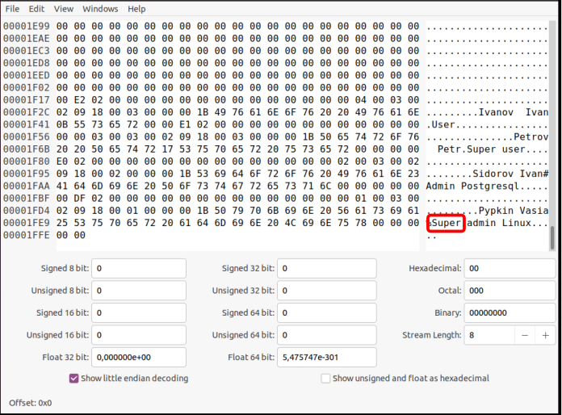
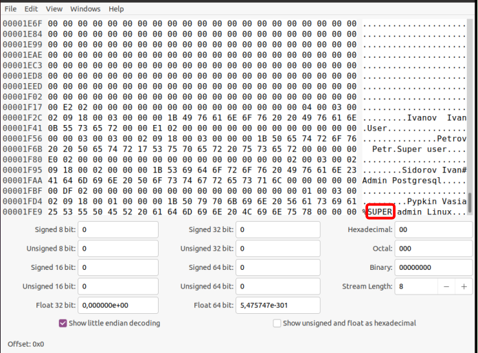

### Работа с журналами

### Цель:

уметь работать с журналами и контрольными точками

уметь настраивать параметры журналов

### Выполнение ДЗ

#### 1. Настройте выполнение контрольной точки раз в 30 секунд.

    Задаем значения парметрам указанным ниже в файле postgresql.conf и перезапускаем кластер:
    
        checkpoint_timeout = 30s               # range 30s-1d
        checkpoint_completion_target = 0.5     # checkpoint target duration, 0.0 - 1.0
        checkpoint_flush_after = 256kB         # measured in pages, 0 disables
        checkpoint_warning = 30s               # 0 disables
        max_wal_size = 1GB
        min_wal_size = 80MB

#### 2. 10 минут c помощью утилиты pgbench подавайте нагрузку.

##### Перед выполнением тестов очищаем статистику по wal и bgwriter

        postgres=# SELECT pg_stat_reset_shared('wal');
        pg_stat_reset_shared 
        ----------------------
        
        (1 row)

        postgres=# SELECT * FROM pg_stat_wal \gx
        -[ RECORD 1 ]----+------------------------------
        wal_records      | 0
        wal_fpi          | 0
        wal_bytes        | 0
        wal_buffers_full | 0
        wal_write        | 0
        wal_sync         | 0
        wal_write_time   | 0
        wal_sync_time    | 0
        stats_reset      | 2022-04-06 19:44:25.042748+03

        postgres=# SELECT pg_stat_reset_shared('bgwriter');;
        pg_stat_reset_shared 
        ----------------------
        
        (1 row)

        postgres=# SELECT * FROM pg_stat_bgwriter \gx
        -[ RECORD 1 ]---------+------------------------------
        checkpoints_timed     | 0
        checkpoints_req       | 0
        checkpoint_write_time | 0
        checkpoint_sync_time  | 0
        buffers_checkpoint    | 0
        buffers_clean         | 0
        maxwritten_clean      | 0
        buffers_backend       | 0
        buffers_backend_fsync | 0
        buffers_alloc         | 0
        stats_reset           | 2022-04-06 19:44:33.235777+03

        postgres=# 

        
##### Запускаем нагрузочный тест.

        postgres@ubuntu-20:~$ pgbench -c8 -P 60 -T 600 -U postgres postgres
        pgbench (14.2 (Ubuntu 14.2-1.pgdg20.04+1))

#### 3. Измерьте, какой объем журнальных файлов был сгенерирован за это время. Оцените, какой объем приходится в среднем на одну контрольную точку.

        postgres=# SELECT * FROM pg_stat_bgwriter \gx
        -[ RECORD 1 ]---------+------------------------------
        checkpoints_timed     | 30
        checkpoints_req       | 0
        checkpoint_write_time | 554570
        checkpoint_sync_time  | 3569
        buffers_checkpoint    | 24078
        buffers_clean         | 0
        maxwritten_clean      | 0
        buffers_backend       | 327
        buffers_backend_fsync | 0
        buffers_alloc         | 325
        stats_reset           | 2022-04-06 19:44:33.235777+03

        postgres=# SELECT * FROM pg_stat_wal \gx
        -[ RECORD 1 ]----+------------------------------
        wal_records      | 369655
        wal_fpi          | 27352
        wal_bytes        | 236559464
        wal_buffers_full | 0
        wal_write        | 50549
        wal_sync         | 50531
        wal_write_time   | 0
        wal_sync_time    | 0
        stats_reset      | 2022-04-06 19:44:25.042748+03

Всего кол-во WAL файлов = (wal_bytes/(1024)/1024)/16 = 14 файлов размеров по 16М

Кол-во WAL на контрольную точку = (Всего кол-во WAL файлов)/(checkpoints_timed) = 0,47 файла. 

#### 4. Проверьте данные статистики: все ли контрольные точки выполнялись точно по расписанию. Почему так произошло?

        postgres=# SELECT * FROM pg_stat_bgwriter \gx
        -[ RECORD 1 ]---------+------------------------------
        checkpoints_timed     | 30
        checkpoints_req       | 0
        checkpoint_write_time | 554570
        checkpoint_sync_time  | 3569
        buffers_checkpoint    | 24078
        buffers_clean         | 0
        maxwritten_clean      | 0
        buffers_backend       | 327
        buffers_backend_fsync | 0
        buffers_alloc         | 325
        stats_reset           | 2022-04-06 19:44:33.235777+03
       
        Все контрольные точки выполнены по расписанию.

        checkpoints_timed — по расписанию (по достижению checkpoint_timeout)
        checkpoints_req — по требованию (в том числе по достижению max_wal_size).

        buffers_checkpoint — процессом контрольной точки,
        buffers_backend — обслуживающими процессами,
        buffers_clean — процессом фоновой записи.

        В хорошо настроенной системе значение buffers_backend должно быть существенно меньше, чем сумма buffers_checkpoint и buffers_clean.
        (buffers_checkpoint+buffers_clean) >> buffers_backend

#### 5. Сравните tps в синхронном/асинхронном режиме утилитой pgbench. Объясните полученный результат.

Проверяем значение параметра synchronous_commit. Значение - on

##### Выполняем pgbench -c8 -P 60 -T 600 -U postgres postgres с значением параметра synchronous_commit = on

Результат:

        pgbench (14.2 (Ubuntu 14.2-1.pgdg20.04+1))
        starting vacuum...end.
        progress: 60.0 s, 86.5 tps, lat 92.417 ms stddev 41.160
        progress: 120.0 s, 80.2 tps, lat 99.735 ms stddev 46.527
        progress: 180.0 s, 69.3 tps, lat 115.445 ms stddev 233.175
        progress: 240.0 s, 84.4 tps, lat 94.757 ms stddev 47.631
        progress: 300.0 s, 83.1 tps, lat 96.185 ms stddev 48.274
        progress: 360.0 s, 60.0 tps, lat 133.263 ms stddev 258.241
        progress: 420.0 s, 71.1 tps, lat 112.731 ms stddev 92.510
        progress: 480.0 s, 84.6 tps, lat 94.512 ms stddev 36.915
        progress: 540.0 s, 82.9 tps, lat 96.572 ms stddev 38.601
        progress: 600.0 s, 71.9 tps, lat 111.218 ms stddev 245.722
        transaction type: <builtin: TPC-B (sort of)>
        scaling factor: 1
        query mode: simple
        number of clients: 8
        number of threads: 1
        duration: 600 s
        number of transactions actually processed: 46446
        latency average = 103.343 ms
        latency stddev = 133.358 ms
        initial connection time = 16.007 ms
        tps = 77.403664 (without initial connection time)

##### Меняем значение параметра synchronous_commit на off, перегружаем кластер. Выполняем pgbench -c8 -P 60 -T 600 -U postgres postgres с значением параметра synchronous_commit = on

Результат:

        postgres@ubuntu-20:~$ pgbench -c8 -P 60 -T 600 -U postgres postgres
        pgbench (14.2 (Ubuntu 14.2-1.pgdg20.04+1))
        starting vacuum...end.
        progress: 60.0 s, 3569.8 tps, lat 2.228 ms stddev 0.895
        progress: 120.0 s, 3503.8 tps, lat 2.271 ms stddev 0.670
        progress: 180.0 s, 3383.1 tps, lat 2.352 ms stddev 4.814
        progress: 240.0 s, 3417.1 tps, lat 2.329 ms stddev 0.857
        progress: 300.0 s, 3560.2 tps, lat 2.235 ms stddev 0.752
        progress: 360.0 s, 3277.0 tps, lat 2.429 ms stddev 28.164
        progress: 420.0 s, 3662.4 tps, lat 2.172 ms stddev 0.702
        progress: 480.0 s, 3526.3 tps, lat 2.256 ms stddev 0.627
        progress: 540.0 s, 3550.4 tps, lat 2.241 ms stddev 0.857
        progress: 600.0 s, 3277.2 tps, lat 2.429 ms stddev 17.895
        transaction type: <builtin: TPC-B (sort of)>
        scaling factor: 1
        query mode: simple
        number of clients: 8
        number of threads: 1
        duration: 600 s
        number of transactions actually processed: 2083652
        latency average = 2.291 ms
        latency stddev = 10.381 ms
        initial connection time = 15.747 ms
        tps = 3472.756326 (without initial connection time)

Количество tps возрасло в 44,86 раза. 

При значении synchronous_commit= off кластер не ждет  локального сброса WAL на диск. В данном случае  может образоваться окно от момента, когда клиент узнаёт об успешном завершении, до момента, когда транзакция действительно гарантированно защищена от сбоя. Тем самым повышается производительность системы

#### 6. Создайте новый кластер с включенной контрольной суммой страниц. Создайте таблицу. Вставьте несколько значений. Выключите кластер. Измените пару байт в таблице. Включите кластер и сделайте выборку из таблицы. Что и почему произошло? как проигнорировать ошибку и продолжить работу?

##### Создаем кластер в которым выполняется расчет контрольных сумм на уровне записей.

    pg_createcluster 14 main2 -- --data-checksums
    root@ubuntu-20:~# pg_ctlcluster 14 main2 start
    root@ubuntu-20:~# pg_lsclusters 
    Ver Cluster Port Status Owner    Data directory               Log file
        14  main    5432 online postgres /var/lib/postgresql/14/main  /var/log/postgresql/postgresql-14-main.log
        14  main2   5433 online postgres /var/lib/postgresql/14/main2 /var/log/postgresql/postgresql-14-main2.log
        
##### Подключаемся к кластеру, создаем БД test_db 
        root@ubuntu-20:~# su - postgres
        postgres@ubuntu-20:~$ psql -p 5433
        psql (14.2 (Ubuntu 14.2-1.pgdg20.04+1))
        Type "help" for help.

        postgres=# \l
                                        List of databases
        Name    |  Owner   | Encoding |   Collate   |    Ctype    |   Access privileges   
        -----------+----------+----------+-------------+-------------+-----------------------
        postgres  | postgres | UTF8     | en_US.UTF-8 | en_US.UTF-8 | 
        template0 | postgres | UTF8     | en_US.UTF-8 | en_US.UTF-8 | =c/postgres          +
                |          |          |             |             | postgres=CTc/postgres
        template1 | postgres | UTF8     | en_US.UTF-8 | en_US.UTF-8 | =c/postgres          +
                |          |          |             |             | postgres=CTc/postgres
        (3 rows)
        postgres=# create database test_db;
        
##### В БД test_bd создаем таблицу tbl_1 и заполняем данными

        postgres=# \c test_db; 
        test_db=# create table tbl_1 (id integer, name text, comment text);
        CREATE TABLE
        test_db=# insert into tbl_1(id,name,comment) values (1,'Pypkin Vasia','Super admin Linux');
        INSERT 0 1
        test_db=# insert into tbl_1(id,name,comment) values (2,'Sidorov Ivan','Admin Postgresql');
        INSERT 0 1
        test_db=# insert into tbl_1(id,name,comment) values (3,'Petrov  Petr','Super user');
        INSERT 0 1
        test_db=# insert into tbl_1(id,name,comment) values (3,'Ivanov  Ivan','User');
        INSERT 0 1
        tesdb=# 
        test_db=# select * from tbl_1 ;
        1 | Pypkin Vasia | Super admin Linux
        2 | Sidorov Ivan | Admin Postgresql
        3 | Petrov  Petr | Super user
        3 | Ivanov  Ivan | User

##### Определяем файл в котором размещены данные таблицы tbl_1

    test_db=# select pg_relation_filepath ('tbl_1');
        pg_relation_filepath 
        ----------------------
        base/16384/16385
        (1 row)

    
##### Выключаем кластер main2 и вносим изменения в файл с данными с помощью HEX-редактора.

Изменяем Super на SUPER

##### Запускаем кластер и пытаемся выполнить select * from tbl_1;

        root@ubuntu-20:~# pg_ctlcluster 14 main2 start
        root@ubuntu-20:~# su - postgres
        postgres@ubuntu-20:~$ psql -p 5433
        psql (14.2 (Ubuntu 14.2-1.pgdg20.04+1+b1))
        Type "help" for help.

        postgres=# \c test_db; 
        You are now connected to database "test_db" as user "postgres".
        
##### Выполняем запрос к таблице tbl_1 и получаем предупреждение что контрольная сумма не сходится.

        test_db=# select * from tbl_1 ;
        WARNING:  page verification failed, calculated checksum 16552 but expected 34047
        ERROR:  invalid page in block 0 of relation base/16384/16385
        test_db=# 

##### Отключаем проверку контрольной суммы на уровне записей.
        test_db=# alter system set ignore_checksum_failure to on;
        ALTER SYSTEM
        test_db=# \q

##### Перзапускаем кластер        
            root@ubuntu-20:~# pg_ctlcluster 14 main2 restart

##### Подключаемся к кластеру            
            root@ubuntu-20:~# su - postgres
            postgres@ubuntu-20:~$ psql -p 5433
            psql (14.2 (Ubuntu 14.2-1.pgdg20.04+1+b1))
            Type "help" for help.

###### Подключаемся к базе данных:            
            postgres=# \c test_db 
            You are now connected to database "test_db" as user "postgres".
            
##### Проверяем значение парметра ignore_checksum_failure.

            test_db=# show ignore_checksum_failure;
            ignore_checksum_failure 
            -------------------------
            on
            (1 row)
            
##### Выполняем запрос. 
            test_db=# select * from tbl_1 ;
            WARNING:  page verification failed, calculated checksum 16552 but expected 34047
            id |     name     |      comment      
            ----+--------------+-------------------
            1 | Pypkin Vasia | SUPER admin Linux
            2 | Sidorov Ivan | Admin Postgresql
            3 | Petrov  Petr | Super user
            3 | Ivanov  Ivan | User
            (4 rows)

            test_db=# 
При отключенной проверке контрольных сумм на уровне записей запрос выполняется и измененное значение выводится.
